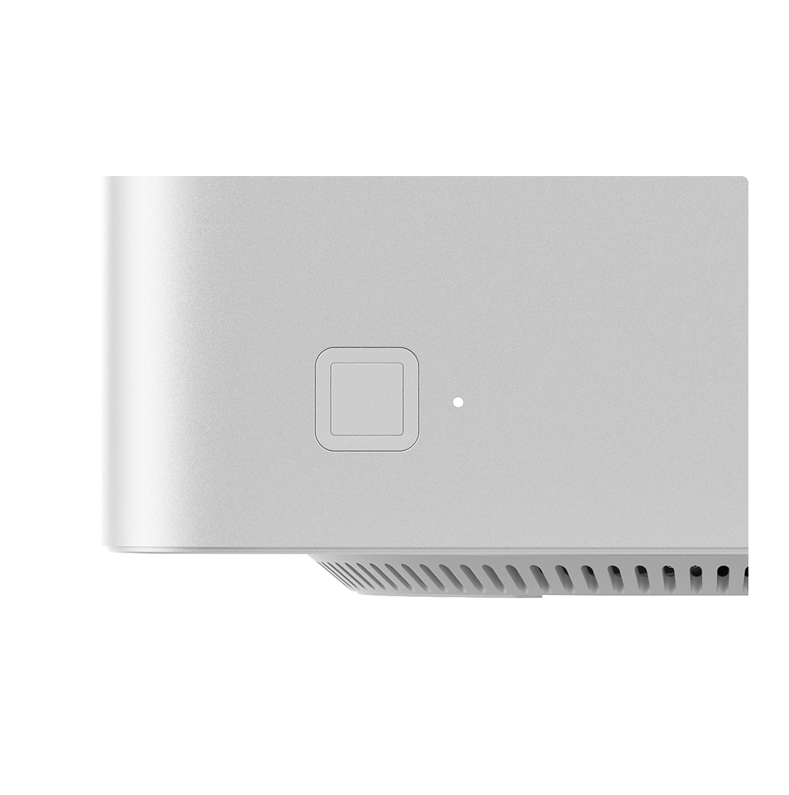

# EH577 fingerprint driver for Linux

A native [libfprint](https://fprint.freedesktop.org/) driver for the **EgisTec EH577**
(USB `1c7a:0577`) fingerprint sensor — the "Windows Hello only" reader on the **Beelink
GTR9 Pro** (and other machines) — so `fprintd`/PAM fingerprint login works on Linux.

<p align="center">
  <br>
  <sub>The EH577 — the fingerprint pad on the corner of the Beelink GTR9 Pro chassis (Beelink product image).</sub>
</p>

## Why the vendor matcher

The EH577 is a tiny (70×57 px, ~6–8 ridges) image-out sensor. On a real lift-and-replace
corpus, **generic open matchers don't hold up cross-session at this size**: whole-image phase
correlation (POC) degrades to EER ~35% (still 66% rank-1 — some signal, but not usable), and
SIGFM/SIFT falls to near chance (23–42% rank-1, ~33% is chance). Minutiae matching
(NBIS/BOZORTH3) isn't viable at all — too few minutiae — though that one we reasoned out
rather than ran. It's the same wall that drove the sibling
[ft9201-libfprint](https://github.com/OMGrant/ft9201-libfprint) to reuse the vendor matcher.
An open matcher at this size is a deep-descriptor ML problem, not correlation tuning. Full
data: **[PORTING.md](PORTING.md#2-why-the-vendor-matcher-the-part-people-will-push-back-on)**.

## How it works

- **Capture** is fully native (no vendor code): the EGIS/SIGE bulk protocol, 70×57 frames.
- **Matching** uses the vendor engine's code, but the **DLL is not loaded at runtime** —
  `eh577-engine.so` is. At *build* time, `gen_egimage` re-lays-out your downloaded DLL's
  sections into a page-aligned image embedded in `eh577-engine.so`. At *runtime*, the driver
  `dlopen`s that self-contained `.so`; a small in-process loader (~190 shims, fake TEB in
  `%gs`) maps the embedded engine image, calls its `WbioQueryEngineInterface` export for the
  WBF vtable, and drives `AcceptSampleData`/`Verify` on host, on plaintext frames.
- **The engine runs file-backed**, so under SELinux it is `file execute` (a normal library
  permission), **not `execmem`**. `fprintd` stays fully confined — no execmem grant, no
  policy hole, no helper process. `/proc/PID/maps` shows the engine mapped `r-xp`, zero
  `rwxp`.
- We target the **2019 Catalog build**, a self-contained software matcher (no SGX enclave,
  no secure-channel handshake), so it runs on any Linux machine.

Architecture, protocol, loader internals, the SELinux model, and Catalog sourcing are all in
**[PORTING.md](PORTING.md)**.

## Copyright

This project contains **no EgisTec or Microsoft binaries**. `EgisTouchFPEngine0577.dll` is
EgisTec's property and is **not distributed here** — the build fetches your own copy from
Microsoft's Update Catalog (pinned update ID + SHA-256) and adapts it locally to run on Linux;
the adapted engine `.so` is built on your machine and never leaves it (the
[ttf-mscorefonts-installer] / [b43-fwcutter] model). The driver, loader, and shims are ours,
**LGPL-2.1-or-later**. This is an interoperability tool for a sensor **you own**; it does not
include or relicense any EgisTec code.

[b43-fwcutter]: https://packages.debian.org/stable/b43-fwcutter
[ttf-mscorefonts-installer]: https://packages.debian.org/stable/ttf-mscorefonts-installer

## Requirements

- An EgisTec EH577 (`1c7a:0577`) sensor **that you own**.
- `curl`, `p7zip` (`7z`), `gcc`, `meson`/`ninja`, `git`, and libfprint build deps.
  - Fedora: `sudo dnf install -y curl p7zip meson ninja-build git gcc && sudo dnf builddep -y libfprint`
  - Debian/Ubuntu: `sudo apt install curl p7zip-full meson ninja-build git build-essential && sudo apt build-dep libfprint`

## Install

```sh
bash setup.sh
```

Downloads your copy of the vendor matcher, builds the engine + libfprint driver, installs it
(SELinux stays enforcing; distro `libfprint` untouched — ours installs side-by-side). Then:

```sh
fprintd-enroll        # sustained hold ~15s; reposition if it asks for coverage
fprintd-verify        # brief hold
sudo authselect enable-feature with-fingerprint   # optional (Fedora): add to login
```

## Uninstall

```sh
sudo bash eh577-install.sh --uninstall
```

Reversible; the distro `libfprint` was never touched.

## What is NOT distributed

This repo contains **no** EgisTec or Microsoft binaries and **no** fingerprint data.
`windows-driver/`, all `*.dll`/`*.cab`, `egimage.bin`, `eh577-engine.so`, and any captures
are `.gitignore`d and must never be committed. Keep it that way in any fork.

## Credits & related projects

Built on the [ft9201-libfprint](https://github.com/OMGrant/ft9201-libfprint) method. The
direct prior art for *this* sensor is
**[championswimmer/libfprint-eh577](https://github.com/championswimmer/libfprint-eh577)** — the
earlier EH577 (`1c7a:0577`) Linux driver effort, which mapped the raw-capture EGIS/SIGE
protocol. Full credits (championswimmer, 3v1n0, uunicorn, the SIGFM authors) and external
resources: **[RESOURCES.md](RESOURCES.md)**.
